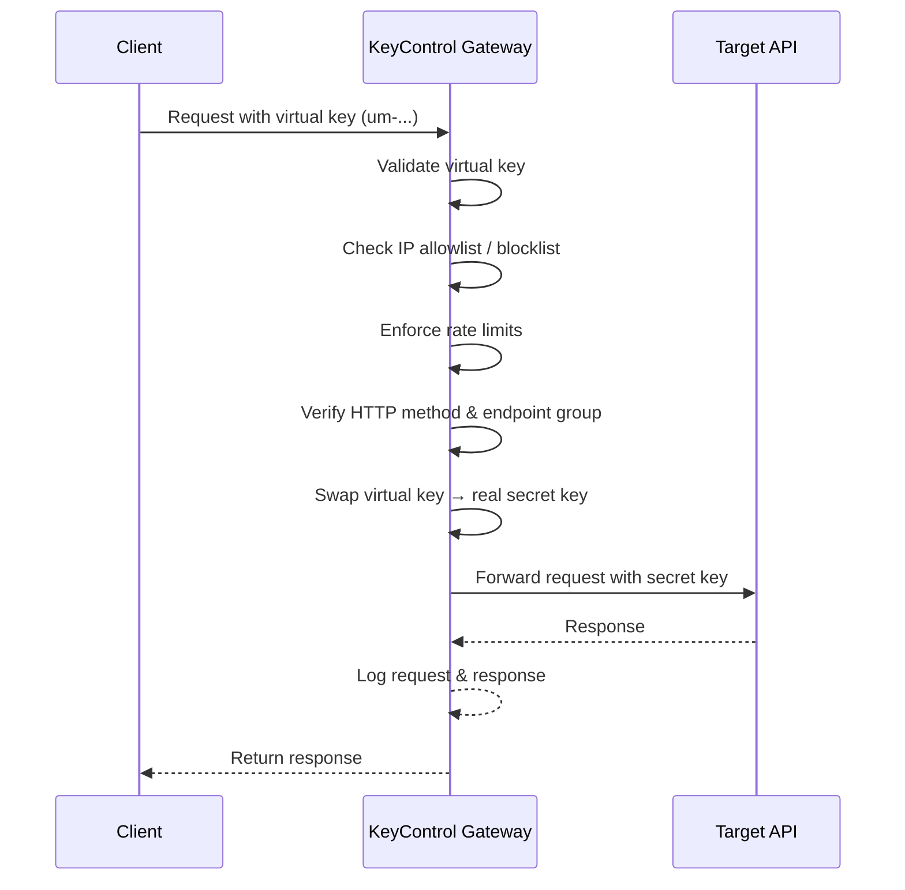

<p align="center">
  
</p>

<h3 align="center">Open-Source API Gateway & Key Management</h3>

<p align="center">
  Protect your secret API keys by splitting them into scoped, rate-limited virtual keys — without ever exposing the originals.
</p>

<p align="center">
  <a href="#api-documentation"><strong>📖 API Documentation</strong></a> · 
  <a href="#quick-start"><strong>🚀 Quick Start</strong></a> · 
  <a href="#how-it-works"><strong>⚙️ How It Works</strong></a>
</p>

---

## Overview

**KeyControl** is a self-hosted API gateway that sits between your clients and your backend services. It takes a single "secret" API key (e.g., OpenAI, Stripe, or any internal API) and lets you create multiple **virtual keys** — each with its own rate limits, IP rules, method restrictions, and endpoint access controls.

When a request comes in with a virtual key, KeyControl validates all the rules, swaps the virtual key for the real one, and forwards the request — all transparently. If a virtual key is compromised, revoke it instantly without rotating your actual secret.

## Features

🔑 **Virtual Key Splitting** — One secret key → many scoped virtual keys (`um-{code}-{random}`)

🚦 **Rate Limiting** — Multi-window sliding limits (e.g., 10/sec + 100/min) per key

🛡️ **IP Allowlists & Blocklists** — Global IP rules with wildcard patterns and custom response codes

🔒 **Endpoint Groups** — Restrict keys to specific URL patterns and HTTP methods

📊 **Request Logging** — Full request/response audit trail with filtering

🌐 **Transparent Proxying** — Automatic key replacement and request forwarding

🔐 **2FA Support** — Optional TOTP two-factor authentication via authenticator apps

👥 **User Management** — Assign keys to users with metadata and notes

## How It Works



## Tech Stack

| Layer        | Technology                                         |
| ------------ | -------------------------------------------------- |
| **Frontend** | React 18, Vite, TypeScript, Tailwind CSS, shadcn/ui |
| **Backend**  | Express.js (ESM), PostgreSQL, JWT, Zod, bcryptjs    |
| **Docs**     | OpenAPI 3.0 + [Scalar](https://scalar.com)          |
| **Testing**  | Vitest + Supertest                                  |
| **Deploy**   | Docker Compose (any VPS)                            |

## Quick Start

### Prerequisites

- **Node.js** 18+
- **PostgreSQL** 16+ (or use the included Docker setup)
- **Docker** *(optional, for local Postgres)*

### 1. Clone & Install

```bash
git clone https://github.com/your-org/keycontrol.git
cd keycontrol
npm run install:all
```

### 2. Set Up the Database

**Option A — Docker (recommended):**

```bash
docker compose -f docker-compose.dev.yml up -d    # Starts Postgres on localhost:5433
```

**Option B — Existing Postgres:**

Point your connection string in `backend/.env` to your instance.

### 3. Configure Environment

```bash
cp backend/.env.example backend/.env
```

Edit `backend/.env` and set your values (see [Environment Variables](#environment-variables) below).

### 4. Run

```bash
npm run dev    # Starts backend (3001) + frontend (5173) concurrently
```

Open **http://localhost:5173** and create your first account.

## Environment Variables

Configure these in `backend/.env`:

| Variable         | Default                          | Description                       |
| ---------------- | -------------------------------- | --------------------------------- |
| `PORT`           | `3001`                           | Server port                       |
| `DATABASE_URL`   | `postgresql://...localhost:5433`  | PostgreSQL connection string      |
| `JWT_SECRET`     | `dev-secret-change-me`           | **Must** change in production     |
| `JWT_EXPIRES_IN` | `24h`                            | Token expiry (`1h`, `7d`, etc.)   |
| `CORS_ORIGINS`   | `http://localhost:5173`          | Comma-separated allowed origins   |
| `BCRYPT_ROUNDS`  | `12`                             | Password hash rounds              |

> [!IMPORTANT]
> Always change `JWT_SECRET` before deploying to production.

## API Documentation

Full interactive API reference is available at:

When running locally, visit **http://localhost:3001/docs**.

In production (Docker), visit **http://your-server/docs**.

The documentation is auto-generated from the [OpenAPI spec](backend/openapi.yaml) and served via [Scalar](https://scalar.com).

## Testing

```bash
# Start the test database
docker compose -f docker-compose.dev.yml up -d

# Run tests
cd backend
npm test            # Single run
npm run test:watch  # Watch mode
```

## Project Structure

```
keycontrol/
├── backend/
│   ├── src/
│   │   ├── config/         # Environment & database config
│   │   ├── db/             # Database initialization & schema
│   │   ├── middleware/     # Auth, validation, error handling
│   │   ├── routes/         # Express route handlers
│   │   ├── services/       # Rate limiter & business logic
│   │   ├── utils/          # Crypto helpers & utilities
│   │   ├── validators/     # Zod request schemas
│   │   ├── app.js          # Express app factory
│   │   └── server.js       # Entry point
│   ├── tests/              # Vitest test suite
│   ├── openapi.yaml        # OpenAPI 3.0 specification
│   └── Dockerfile          # Production container
├── frontend/
│   └── src/
│       ├── components/     # React UI components (shadcn/ui)
│       ├── lib/            # API client, auth, utilities
│       └── pages/          # Route pages
├── docker-compose.dev.yml  # Local dev Postgres
├── docker-compose.prod.yml # Production full-stack setup
├── .env.production.example # Production env template
└── package.json            # Root workspace scripts
```

## Contributing

Contributions are welcome! Please follow these steps:

1. **Fork** the repository
2. **Create** a feature branch (`git checkout -b feature/my-feature`)
3. **Commit** your changes (`git commit -m 'Add my feature'`)
4. **Push** to the branch (`git push origin feature/my-feature`)
5. **Open** a Pull Request

## License

This project is open source. See the [LICENSE](LICENSE) file for details.

---

<p align="center">
  Built with ❤️ by the KeyControl team
</p>
