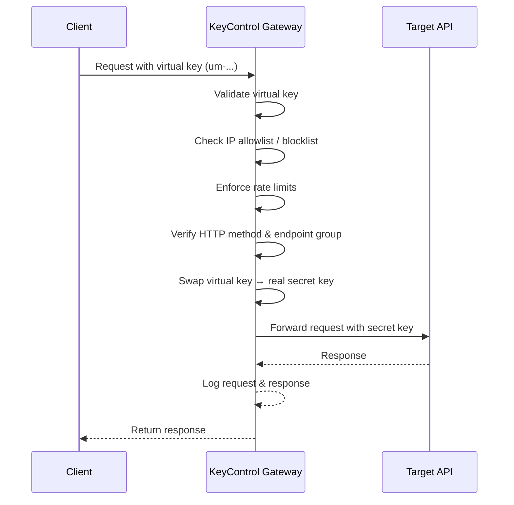

<p align="center">
  
</p>

<h3 align="center">Open-Source API Gateway & Key Management</h3>

<p align="center">
  Protect your secret API keys by splitting them into scoped, rate-limited virtual keys — without ever exposing the originals.
</p>

<p align="center">
  <a href="LICENSE.txt"></a>
  <a href="#quick-start"></a>
</p>

<p align="center">
  <a href="#quick-start"><strong>🚀 Quick Start</strong></a> · 
  <a href="#how-it-works"><strong>⚙️ How It Works</strong></a> · 
  <a href="#api-documentation"><strong>📖 API Docs</strong></a> · 
  <a href="SETUP.md"><strong>🛠️ Dev Setup</strong></a>
</p>

---

## Overview

**KeyControl** is a self-hosted API gateway that sits between your clients and upstream API providers (Bunny.net, Vercel, Anthropic, Twilio, etc.). It takes a single "secret" API key and lets you create multiple **virtual keys** (prefixed `um-`), each with its own rate limits, IP rules, method restrictions, and endpoint access controls.

When a request comes in with a virtual key, KeyControl validates all the rules, swaps the virtual key for the real one, and forwards the request — all transparently. If a virtual key is compromised, revoke it instantly without rotating your actual secret.

## Features

🔑 **Virtual Key Splitting** — One secret key → many scoped virtual keys limited to certain endpoints/methods (prefixed `um-`)

🎛️ **Presets** — Reusable access policies that bundle resources, methods, rate limits, and IP rules

🚦 **Rate Limiting** — Multi-window sliding limits (e.g., 10/sec + 100/min) per key

🛡️ **IP Allowlists & Blocklists** — IP rules with wildcard patterns and CIDR notation

🔒 **Endpoint Groups** — Restrict keys to specific URL patterns and HTTP methods

📊 **Request Logging** — Full request audit trail with filtering, togglable logging and IP logging

🌐 **Transparent Proxying** — Automatic key replacement and request forwarding

🔐 **2FA Support** — Optional TOTP two-factor authentication via authenticator apps

🔑 **Master API Key** — Long-lived `mk-` key for programmatic admin access (CI/CD, scripts)

🎨 **Customizable Dashboard** — Theme, font, color, and border radius customization

## How It Works



## Quick Start

The fastest way to run KeyControl is with **Docker Compose**. This spins up PostgreSQL, the backend API, and the frontend behind Nginx — all in one command.

### Prerequisites

- [Docker Engine](https://docs.docker.com/get-docker/) ≥ 20
- [Docker Compose](https://docs.docker.com/compose/install/) V2 (usually bundled with Docker Engine)

### 1. Clone the repository

```bash
git clone https://github.com/behind24proxies/keycontrol.git
cd keycontrol
```

### 2. Configure environment

```bash
cp .env.production.example .env.production
```

Open `.env.production` and fill in the required values:

| Variable | Required | Description |
|----------|----------|-------------|
| `POSTGRES_PASSWORD` | **Yes** | Database password — use a strong random value |
| `JWT_SECRET` | **Yes** | Secret for signing auth tokens — use a long random string (64+ chars) |
| `ADMIN_TOKEN` | **Yes** | Your admin login password for the dashboard |
| `DASHBOARD_PORT` | No | Port for the web interface (default: `8080`) |
| `CORS_ORIGINS` | No | Only needed if accessing the API from a different domain |
| `LOG_RETENTION_SECONDS` | No | How long to keep request logs (default: 30 days) |

### 3. Build and start

```bash
docker compose -f docker-compose.prod.yml --env-file .env.production up -d --build
```

First run takes 2–3 minutes to pull base images and build.

### 4. Verify

```bash
# All containers should show "Up" or "healthy"
docker compose -f docker-compose.prod.yml ps

# Test the API
curl http://localhost:8080/api
```

### 5. Open in your browser

Navigate to `http://localhost:8080` and log in with the `ADMIN_TOKEN` you set in step 2.

### Managing the stack

| Command | Description |
|---------|-------------|
| `docker compose -f docker-compose.prod.yml --env-file .env.production up -d --build` | Build and start all services |
| `docker compose -f docker-compose.prod.yml down` | Stop all services (data is preserved) |
| `docker compose -f docker-compose.prod.yml logs -f` | Tail logs from all services |


### Updating

```bash
git pull
docker compose -f docker-compose.prod.yml --env-file .env.production up -d --build
```

## Architecture

```
┌──────────────────────────────────────────────────────────────┐
│  Docker Host                                                 │
│                                                              │
│   Port 8080 → Nginx                                          │
│               ├── /api/*       → Backend (admin REST API)    │
│               ├── /gateway/*   → Backend (gateway proxy)     │
│               ├── /docs        → Backend (API documentation) │
│               └── /*           → Frontend SPA                │
│                                                              │
│   (internal) → PostgreSQL :5432                              │
└──────────────────────────────────────────────────────────────┘
```


## API Documentation

Full interactive API reference is available at `/docs` once the stack is running.

The documentation is auto-generated from the [OpenAPI spec](backend/openapi.yaml) and served via [Scalar](https://scalar.com). It includes a comprehensive **Platform Guide** with setup instructions, UI walkthroughs, and a Quick Start tutorial.

## Tech Stack

| Layer        | Technology                                         |
| ------------ | -------------------------------------------------- |
| **Frontend** | React 18, Vite, TypeScript, Tailwind CSS, shadcn/ui |
| **Backend**  | Express.js (ESM), PostgreSQL, JWT, Zod, bcryptjs    |
| **Docs**     | OpenAPI 3.0 + [Scalar](https://scalar.com)          |
| **Testing**  | Vitest + Supertest                                  |
| **Deploy**   | Docker Compose (any VPS)                            |

## Project Structure

```
keycontrol/
├── backend/
│   ├── src/
│   │   ├── config/         # Environment & database config
│   │   ├── db/             # Database initialization & schema
│   │   ├── errors/         # Custom error classes (AppError)
│   │   ├── middleware/     # Auth, validation, error handling
│   │   ├── routes/         # Express route handlers
│   │   ├── services/       # Rate limiter & business logic
│   │   ├── utils/          # Crypto helpers & utilities
│   │   ├── validators/     # Zod request schemas
│   │   ├── app.js          # Express app factory
│   │   └── server.js       # Entry point
│   ├── tests/              # Vitest test suite
│   ├── openapi.yaml        # OpenAPI 3.0 specification
│   └── Dockerfile          # Production container
├── frontend/
│   └── src/
│       ├── components/     # React UI components (shadcn/ui)
│       ├── lib/            # API client, auth, utilities
│       └── pages/          # Route pages
├── docker/                 # Nginx config for production
├── docker-compose.prod.yml # Production full-stack setup
├── docker-compose.dev.yml  # Local dev Postgres
├── .env.production.example # Production env template
├── SETUP.md                # Local development guide
└── package.json            # Root workspace scripts
```

## Local Development

For running KeyControl with Node.js and npm (useful for contributing and debugging), see the **[Development Setup Guide](SETUP.md)**.

## Contributing

Contributions are welcome! To get started:

1. Read the **[Development Setup Guide](SETUP.md)** to set up your local environment
2. **Fork** the repository
3. **Create** a feature branch (`git checkout -b feature/my-feature`)
4. **Commit** your changes (`git commit -m 'Add my feature'`)
5. **Push** to the branch (`git push origin feature/my-feature`)
6. **Open** a Pull Request

## License

KeyControl is licensed under the [GNU General Public License v3.0](LICENSE.txt).

---

<p align="center">
  Built with ❤️ by the KeyControl team<br/>
  📧 <a href="mailto:keycontrolteam@proton.me">keycontrolteam@proton.me</a>
</p>
