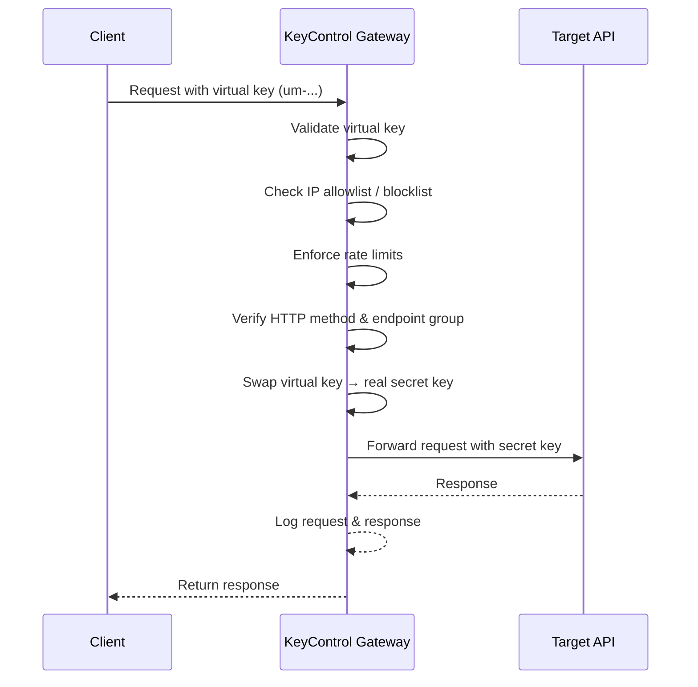

<p align="center">
  
</p>

<h3 align="center">Open-Source API Gateway & Key Management</h3>

<p align="center">
  Protect your secret API keys by splitting them into scoped, rate-limited virtual keys,  without ever exposing the originals.
</p>

<p align="center">
  <a href="#api-documentation"><strong>📖 API Documentation</strong></a> · 
  <a href="#quick-start"><strong>🚀 Quick Start</strong></a> · 
  <a href="#how-it-works"><strong>⚙️ How It Works</strong></a>
</p>

---

## Overview

**KeyControl** is a self-hosted API gateway that sits between your clients and upstream API providers (Bunny.net, Vercel, Anthropic, Twilio etc.). It takes a single "secret" API key and lets you create multiple **virtual keys** (prefixed `um-`),  each with its own rate limits, IP rules, method restrictions, and endpoint access controls.

When a request comes in with a virtual key, KeyControl validates all the rules, swaps the virtual key for the real one, and forwards the request,  all transparently. If a virtual key is compromised, revoke it instantly without rotating your actual secret.

## Features

🔑 **Virtual Key Splitting**,  One secret key → many scoped virtual keys limited to certain endpoints/methods (prefixed `um-`)

🎛️ **Presets**,  Reusable access policies that bundle resources, methods, rate limits, and IP rules

🚦 **Rate Limiting**,  Multi-window sliding limits (e.g., 10/sec + 100/min) per key

🛡️ **IP Allowlists & Blocklists**,  IP rules with wildcard patterns and CIDR notation

🔒 **Endpoint Groups**,  Restrict keys to specific URL patterns and HTTP methods

📊 **Request Logging**,  Full request audit trail with filtering, togglable logging and IP logging

🌐 **Transparent Proxying**,  Automatic key replacement and request forwarding

🔐 **2FA Support**,  Optional TOTP two-factor authentication via authenticator apps

🔑 **Master API Key**,  Long-lived `mk-` key for programmatic admin access (CI/CD, scripts)

🎨 **Customizable Dashboard**,  Theme, font, color, and border radius customization

## How It Works



## Tech Stack

| Layer        | Technology                                         |
| ------------ | -------------------------------------------------- |
| **Frontend** | React 18, Vite, TypeScript, Tailwind CSS, shadcn/ui |
| **Backend**  | Express.js (ESM), PostgreSQL, JWT, Zod, bcryptjs    |
| **Docs**     | OpenAPI 3.0 + [Scalar](https://scalar.com)          |
| **Testing**  | Vitest + Supertest                                  |
| **Deploy**   | Docker Compose (any VPS)                            |

## Quick Start


### Prerequisites

- **Node.js** 18+
- **PostgreSQL** 16+ (or use the included Docker setup)
- **Docker** *(optional, for local Postgres)*

### 1. Clone & Install

```bash
git clone https://github.com/behind24proxies/keycontrol.git
cd keycontrol
npm run install:all
```

### 2. Set Up the Database

**Option A,  Docker (recommended):**

```bash
npm run db:up    # Starts Postgres on localhost:5433
```

**Option B,  Existing Postgres:**

Point your connection string in `backend/.env` to your instance.

### 3. Configure Environment

```bash
cp backend/.env.example backend/.env
```

Edit `backend/.env` and set your values (see [Environment Variables](#environment-variables) below).

### 4. Run

```bash
npm run dev    # Starts backend (3001) + frontend (3000) concurrently
```

Open **http://localhost:3000** and log in with the password you set in `ADMIN_TOKEN`.

## Environment Variables

Configure these in `backend/.env`:

| Variable | Required | Default | Description |
| --- | --- | --- | --- |
| `ADMIN_TOKEN` | **Yes** |,  | Initial admin password (used on first boot to seed the login) |
| `JWT_SECRET` | **Yes** | `change-me-in-production` | Secret key for signing JWT tokens,  **must** change in production |
| `DATABASE_URL` | **Yes** | `postgresql://...localhost:5433/keycontrol` | PostgreSQL connection string |
| `PORT` | No | `3001` | Backend server port |
| `JWT_EXPIRES_IN` | No | `24h` | Token expiry (`1h`, `7d`, etc.) |
| `CORS_ORIGINS` | No | `http://localhost:3000` | Comma-separated allowed origins |
| `FRONTEND_URL` | No | `http://localhost:3000` | Frontend dashboard URL |
| `RESET_HASH` | No |,  | Secret string for password recovery (single-use) |
| `LOG_RETENTION_SECONDS` | No | `2592000` | How long to keep request logs (default: 30 days) |
| `LOG_FLUSH_INTERVAL_MS` | No | `5000` | Log buffer flush interval |
| `LOG_MAX_BATCH_SIZE` | No | `500` | Max log entries per flush |

> [!IMPORTANT]
> Always change `JWT_SECRET` and set `ADMIN_TOKEN` before deploying to production.

## API Documentation

Full interactive API reference is available at:

When running locally, visit **http://localhost:3001/docs**.

In production (Docker), visit **http://your-server/docs**.

The documentation is auto-generated from the [OpenAPI spec](backend/openapi.yaml) and served via [Scalar](https://scalar.com). It includes a comprehensive **Platform Guide** with setup instructions, UI walkthroughs, and a Quick Start tutorial.

## NPM Scripts

All root-level scripts can be run with `npm run <script>`:

| Script | Description |
| --- | --- |
| `dev` | Start backend + frontend concurrently |
| `dev:backend` | Start only the backend |
| `dev:frontend` | Start only the frontend |
| `install:all` | Install dependencies for root, backend, and frontend |
| `db:up` | Start dev Postgres via Docker |
| `db:down` | Stop dev Postgres |
| `db:reset` | Wipe and recreate dev database |
| `db:logs` | Tail Postgres container logs |
| `test` | Run backend test suite |
| `test:watch` | Run tests in watch mode |
| `gen:secret` | Generate a random secret (for JWT_SECRET, ADMIN_TOKEN) |
| `prod:up` | Build and start production Docker stack |
| `prod:down` | Stop production stack |
| `prod:logs` | Tail production logs |
| `prod:restart` | Restart production containers |
| `prod:reset` | Wipe and rebuild production stack |

## Testing

```bash
# Start the test database
npm run db:up

# Run tests
npm test            # Single run
npm run test:watch  # Watch mode
```

## Project Structure

```
keycontrol/
├── backend/
│   ├── src/
│   │   ├── config/         # Environment & database config
│   │   ├── db/             # Database initialization & schema
│   │   ├── errors/         # Custom error classes (AppError)
│   │   ├── middleware/     # Auth, validation, error handling
│   │   ├── routes/         # Express route handlers
│   │   ├── services/       # Rate limiter & business logic
│   │   ├── utils/          # Crypto helpers & utilities
│   │   ├── validators/     # Zod request schemas
│   │   ├── app.js          # Express app factory
│   │   └── server.js       # Entry point
│   ├── tests/              # Vitest test suite
│   ├── openapi.yaml        # OpenAPI 3.0 specification
│   └── Dockerfile          # Production container
├── frontend/
│   └── src/
│       ├── components/     # React UI components (shadcn/ui)
│       ├── lib/            # API client, auth, utilities
│       └── pages/          # Route pages
├── docker-compose.dev.yml  # Local dev Postgres
├── docker-compose.prod.yml # Production full-stack setup
├── .env.production.example # Production env template
└── package.json            # Root workspace scripts
```

## Production Deployment

```bash
# 1. Copy and configure production env
cp .env.production.example .env.production
# Edit .env.production with your values

# 2. Build and start
npm run prod:up

# 3. Access the dashboard
# Default: http://your-server:8080
```

> [!TIP]
> Put a reverse proxy (Caddy, Nginx) in front for HTTPS. The default production port is `8080` to leave port 80/443 free for the proxy.

## Contributing

Contributions are welcome! Please follow these steps:

1. **Fork** the repository
2. **Create** a feature branch (`git checkout -b feature/my-feature`)
3. **Commit** your changes (`git commit -m 'Add my feature'`)
4. **Push** to the branch (`git push origin feature/my-feature`)
5. **Open** a Pull Request

---

<p align="center">
  Built with ❤️ by the KeyControl team
</p>
